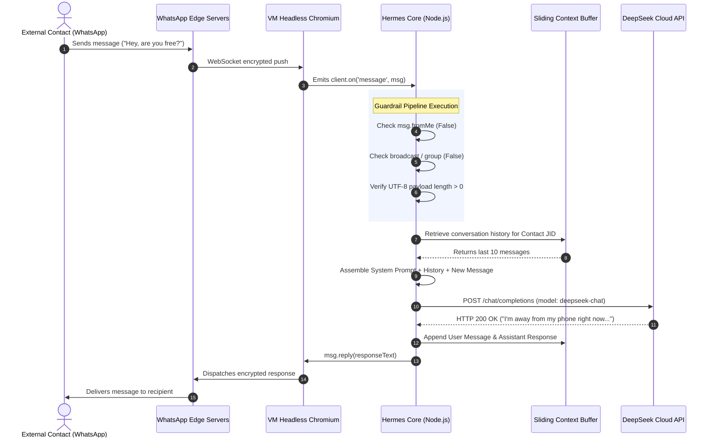

# 🏛️ Hermes WhatsApp AI Agent on Google Cloud VM

[](https://cloud.google.com/)
[](https://nodejs.org/)
[](https://deepseek.com/)
[](https://pm2.keymetrics.io/)
[](https://wwebjs.dev/)

An autonomous, 24/7 personal WhatsApp AI assistant engineered to run continuously on a dedicated Google Cloud Platform (GCP) virtual machine. Powered by the **DeepSeek-Chat** reasoning engine (with seamless fallback to **Google Gemini** and **OpenRouter Nous Hermes 3**), the agent monitors inbound WhatsApp communications, contextually reasons over conversation histories, and formulates concise, intelligent replies in real time without requiring the physical phone to be powered on or connected.

---

## 📐 Systematic System Architecture

The following block diagram depicts the complete multi-tiered engineering architecture of the Hermes Agent spanning networking, headless virtualization, message ingestion pipelines, memory buffers, and upstream cloud LLM services:

```
+---------------------------------------------------------------------------------------------------+
|                                     INBOUND WHATSAPP CLIENTS                                      |
|                 [ Personal Contacts ]      [ Business Contacts ]      [ Groups ]                  |
+---------------------------------------------------------------------------------------------------+
                                                  │
                                                  │ (WhatsApp Encrypted Signal Protocol)
                                                  ▼
+---------------------------------------------------------------------------------------------------+
|                                 GOOGLE COMPUTE ENGINE VIRTUAL MACHINE                             |
|                                       IP: 136.65.153.237                                          |
|                                                                                                   |
|  +---------------------------------------------------------------------------------------------+  |
|  | [1] COMMUNICATION GATEWAY & PROTOCOL LAYER                                                  |  |
|  |                                                                                             |  |
|  |    +-----------------------------+               +-------------------------------------+    |  |
|  |    | WhatsApp Multi-Device Sync  | ◄───────────► | Chromium Engine (Puppeteer Headless)|    |  |
|  |    +-----------------------------+               +-------------------------------------+    |  |
|  |                   │                                                 │                       |  |
|  |                   ▼                                                 ▼                       |  |
|  |    +-----------------------------------------------------------------------------------+    |  |
|  |    | Session Persistence Cache: .wwebjs_auth/ (Persistent Multi-Device Tokens)         |    |  |
|  |    +-----------------------------------------------------------------------------------+    |  |
|  +---------------------------------------------------------------------------------------------+  |
|                                                  │                                                |
|                                                  ▼ (Message Event Stream)                         |
|  +---------------------------------------------------------------------------------------------+  |
|  | [2] INGESTION, FILTERING & GUARDRAIL PIPELINE                                               |  |
|  |                                                                                             |  |
|  |    ┌───────────────────────────────────────────────────────────────────────────────────┐    |  |
|  |    │ • Broadcast Filter: Drops "status@broadcast" events                               │    |  |
|  |    │ • Group Chat Filter: Ignores "@g.us" threads (configurable)                       │    |  |
|  |    │ • Self-Echo Filter: Discards "msg.fromMe === true" to prevent infinite loops      │    |  |
|  |    │ • Content Sanitizer: Discards empty payloads, validates UTF-8 text bodies         │    |  |
|  |    └───────────────────────────────────────────────────────────────────────────────────┘    |  |
|  +---------------------------------------------------------------------------------------------+  |
|                                                  │                                                |
|                                                  ▼ (Sanitized User Text)                          |
|  +---------------------------------------------------------------------------------------------+  |
|  | [3] COGNITIVE CORE & CONVERSATION STATE BUFFER                                              |  |
|  |                                                                                             |  |
|  |    +-----------------------------------------------------------------------------------+    |  |
|  |    | Dynamic Sliding-Window Memory Map (Key: JID / Phone Number, Max 10 Turns FIFO)    |    |  |
|  |    +-----------------------------------------------------------------------------------+    |  |
|  |                                                  │                                             |
|  |                                                  ▼                                             |
|  |    +-----------------------------------------------------------------------------------+    |  |
|  |    | Persona & Instruction Assembler (Injects OWNER_NAME, BOT_NAME, System Directives)  |    |  |
|  |    +-----------------------------------------------------------------------------------+    |  |
|  |                                                  │                                             |
|  |                                                  ▼                                             |
|  |    +-----------------------------------------------------------------------------------+    |  |
|  |    | Multi-Model Provider Router (Factory Pattern)                                     |    |  |
|  |    +-----------------------------------------------------------------------------------+    |  |
|  |            │                                    │                                  │        |  |
|  +------------┼────────────────────────────────────┼──────────────────────────────────┼--------+  |
|               │                                    │                                  │           |
|               ▼                                    ▼                                  ▼           |
|  +-------------------------+      +-------------------------------+     +----------------------+  |
|  | DeepSeek Client Adapter |      | Google Gemini Client Adapter  |     | OpenRouter Hermes    |  |
|  | (Primary Cognitive Brain|      | (High-Throughput Secondary)   |     | (Custom Persona Model|  |
|  +-------------------------+      +-------------------------------+     +----------------------+  |
+---------------│------------------------------------│----------------------------------│-----------+
                │ (HTTPS / TLS 1.3)                  │ (HTTPS / TLS 1.3)                │ (HTTPS)
                ▼                                    ▼                                  ▼
+────────────────────────────+      +───────────────────────────────+     +──────────────────────+
|   DeepSeek Cloud API       |      | Google Generative Language API|     | OpenRouter API Cloud |
| (deepseek-chat / v3 Model) |      | (gemini-2.5-flash / Pro)      |     | (hermes-3-llama-3.1) |
+────────────────────────────+      +───────────────────────────────+     +──────────────────────+
```

---

## 🧩 Architectural Component Decomposition

### 1. Communication Gateway & Transport Layer
* **WhatsApp Multi-Device Engine:** Utilizes `@whiskeysockets/baileys` and `whatsapp-web.js` abstractions to sustain persistent WebSocket tunnels with Meta's messaging edges.
* **Headless Virtualization:** Puppeteer controls an isolated, headless Chromium instance with security sandboxing tuned for cloud server environments (`--no-sandbox`, `--disable-setuid-sandbox`, `--disable-dev-shm-usage`).
* **Session Persistence (`.wwebjs_auth`):** Cryptographic session tokens, private keys, and authentication states are committed to disk upon initial QR pairing, ensuring autonomous reconnects even after process restarts or VM cold reboots.

### 2. Message Ingestion & Guardrail Pipeline
Every incoming packet traverses a deterministic validation cascade:
1. **Status Broadcast Suppression:** Messages originating from `status@broadcast` are immediately dropped.
2. **Channel Type Demuxing:** Inbound group messages (`@g.us`) are dropped by default to prevent token runaway and privacy leakage.
3. **Loop Prevention:** The agent evaluates `msg.fromMe`; self-emitted notifications are terminated immediately.
4. **Debouncing & Rate Throttling:** Rapid bursts from single contacts are queued to prevent concurrent model invocations.

### 3. Cognitive Engine & Context State Buffer
* **Sliding-Window Memory Buffer:** Maintains an in-memory `Map<ContactJID, MessageHistory[]>` bounded at 10 historical conversation turns (FIFO eviction). This preserves immediate context without saturating LLM context windows or incurring unnecessary token costs.
* **System Prompt Injection:** Injects user-defined persona guidelines, owner identification, and strict behavioral directives before dispatching requests upstream.
* **Provider Abstraction:** Decoupled client architecture allows hot-swapping between:
  * **DeepSeek (`deepseek-chat`):** Primary production driver for concise, conversational answers.
  * **Google Gemini (`gemini-2.5-flash`):** High-throughput secondary provider.
  * **OpenRouter Nous Hermes 3 (`hermes-3-llama-3.1-8b`):** Specialized persona model.

### 4. Process Supervision & Self-Healing (PM2)
* **Daemon Supervision:** Managed by PM2 as a system service. If Chromium encounters a memory leak or network dropout, PM2 automatically halts and restarts the process within seconds.
* **Auto-Resurrection:** Integrated with Linux `systemd` (`pm2 startup` + `pm2 save`) to auto-launch on instance restarts.

### 5. Hardware & OS Kernel Performance Topology
```
+-----------------------------------------------------------------------------+
|                          GCP COMPUTE ENGINE (e2-medium)                     |
|                                2 vCPUs | 4.0 GB RAM                         |
+-----------------------------------------------------------------------------+
|                               MEMORY HIERARCHY                              |
|                                                                             |
|  [ Physical RAM (4096 MB) ]                                                 |
|  ├── System & OS Baseline: ~250 MB                                          |
|  ├── Node.js / V8 Heap Allocation: Up to 2048 MB (--max-old-space-size=2048)|
|  └── Headless Chromium (Puppeteer Browser): ~800 MB - 1200 MB               |
|                                                                             |
|  [ Tier 1 Swap: ZRAM Compressed In-Memory Buffer ]                          |
|  └── Algorithm: zstd | Allocated: 50% RAM | Ultra-fast ~5x disk speed       |
|                                                                             |
|  [ Tier 2 Swap: Persistent Disk File (/swapfile) ]                          |
|  └── Size: 2048 MB | Kernel Swappiness: vm.swappiness=10                    |
+-----------------------------------------------------------------------------+
```

---

## 🔄 End-to-End Sequence Flow



---

## 🛠️ Step-by-Step Deployment & Configuration

### 1. Provisioning the Google Cloud Compute Engine VM
* **Console Path:** Google Cloud Console -> Compute Engine -> VM instances -> Create Instance
* **Cloud Shell Provisioning Command:**
```bash
gcloud compute instances create hermes-whatsapp-agent \
  --project=utility-melody-390608 \
  --zone=us-central1-a \
  --machine-type=e2-medium \
  --image-family=ubuntu-2204-lts \
  --image-project=ubuntu-os-cloud \
  --boot-disk-size=30GB \
  --boot-disk-type=pd-balanced \
  --tags=http-server,https-server
```

### 2. Static External IP Reservation
Promoting your ephemeral external IP to static guarantees SSH endpoints and local webhooks never break:
```bash
gcloud compute addresses create hermes-static-ip \
  --addresses=136.65.153.237 \
  --region=us-central1
```

### 3. Server Initialization & Dependency Installation
Connect to the server via SSH:
```powershell
ssh -i "$env:USERPROFILE\.ssh\google_compute_engine" sgarm@136.65.153.237
```

Update system packages and install Node.js 20 LTS:
```bash
sudo apt update && sudo apt upgrade -y
sudo apt install -y curl wget git build-essential software-properties-common

# Install Node.js 20 LTS
curl -fsSL https://deb.nodesource.com/setup_20.x | sudo -E bash -
sudo apt install -y nodejs

# Install Puppeteer / Chromium Linux libraries
sudo apt install -y \
  gconf-service libasound2 libatk1.0-0 libatk-bridge2.0-0 libc6 libcairo2 libcups2 \
  libdbus-1-3 libexpat1 libfontconfig1 libgcc1 libgconf-2-4 libgdk-pixbuf2.0-0 \
  libglib2.0-0 libgtk-3-0 libnspr4 libpango-1.0-0 libpangocairo-1.0-0 libstdc++6 \
  libx11-6 libx11-xcb1 libxcb1 libxcomposite1 libxcursor1 libxdamage1 libxext6 \
  libxfixes3 libxi6 libxrandr2 libxrender1 libxss1 libxtst6 ca-certificates \
  fonts-liberation libappindicator1 libnss3 lsb-release xdg-utils libgbm1 libxkbcommon0

# Install PM2 Process Manager
sudo npm install -g pm2
```

---

## ⚙️ Configuration & Environment Setup

Clone or create the project under `/home/sgarm/whatsapp-agent`:
```bash
mkdir -p /home/sgarm/whatsapp-agent && cd /home/sgarm/whatsapp-agent
```

Create your `.env` configuration file:
```env
# Choose AI provider: 'deepseek', 'gemini', or 'hermes'
AI_PROVIDER=deepseek

# DeepSeek Configuration
DEEPSEEK_API_KEY=your_deepseek_api_key_here
DEEPSEEK_BASE_URL=https://api.deepseek.com
DEEPSEEK_MODEL=deepseek-chat

# Google Gemini Configuration (Fallback)
GEMINI_API_KEY=your_gemini_api_key_here
GEMINI_MODEL=gemini-2.5-flash

# Hermes Configuration (via OpenRouter)
HERMES_API_KEY=your_openrouter_api_key_here
HERMES_BASE_URL=https://openrouter.ai/api/v1
HERMES_MODEL=nousresearch/hermes-3-llama-3.1-8b

# Persona Directives
OWNER_NAME=YourName
BOT_NAME=Hermes AI Assistant
SYSTEM_PROMPT=You are Hermes, an intelligent personal assistant managing WhatsApp messages for your owner while they are away from their phone. Keep answers concise, polite, helpful, and natural.
```

---

## 📲 WhatsApp Pairing & QR Code Protocol

### Option A: Read QR Code directly in PowerShell
```powershell
ssh -i "$env:USERPROFILE\.ssh\google_compute_engine" sgarm@136.65.153.237 "pm2 logs whatsapp-agent --lines 60 --nostream"
```

### Option B: Local Browser Forwarding
Create an SSH tunnel binding the remote Express server to your local machine:
```powershell
ssh -i "$env:USERPROFILE\.ssh\google_compute_engine" -L 3000:localhost:3000 sgarm@136.65.153.237
```
Then navigate to `http://localhost:3000` in your local browser to scan the visual code.

### ⚠️ Resolving "Cannot link new devices, try again later"
If WhatsApp temporarily blocks pairing attempts due to connection retries:
1. `pm2 stop whatsapp-agent`
2. Purge stale/corrupt session files:
   ```bash
   rm -rf /home/sgarm/whatsapp-agent/.wwebjs_auth /home/sgarm/whatsapp-agent/.wwebjs_cache
   ```
3. Wait **5 minutes** for WhatsApp rate-limiting to expire.
4. Restart agent: `pm2 start whatsapp-agent` and scan the fresh QR code.

---

## ⚡ Applied Performance MODS & Optimizations

| Mod | Optimization | Architectural Benefit |
| :--- | :--- | :--- |
| **MOD 1: Compute Resizing** | Upgraded `e2-micro` (1 GB) -> `e2-medium` (4 GB) | Eliminates Linux OOM process terminations during Chromium rendering cycles |
| **MOD 2: Swap Hierarchy** | Created 2GB swap with `vm.swappiness=10` | Guarantees kernel stability while keeping active Node and Chromium heaps strictly in RAM |
| **MOD 3: V8 Heap Expansion** | Configured `--max-old-space-size=2048` in PM2 | Prevents Node runtime garbage collector thrashing |
| **MOD 4: In-Memory ZRAM** | Activated `zstd` compressed RAM swap | Delivers sub-millisecond memory paging 5x faster than persistent disk swap |
| **MOD 5: DeepSeek Migration** | Swapped Gemini flash for `deepseek-chat` | Significantly improves reasoning quality and conversational naturalness |
| **MOD 6: 24/7 Autostart Hook** | `pm2 startup systemd` & `pm2 save` | Ensures instant daemon recovery across cloud host maintenance events |

---

## 🕹️ Operations & Maintenance Cheatsheet

```powershell
# 1. Check live agent status and uptime
ssh -i "$env:USERPROFILE\.ssh\google_compute_engine" sgarm@136.65.153.237 "pm2 status"

# 2. Stream real-time incoming WhatsApp logs
ssh -i "$env:USERPROFILE\.ssh\google_compute_engine" sgarm@136.65.153.237 "pm2 logs whatsapp-agent"

# 3. Restart the agent with updated environment variables
ssh -i "$env:USERPROFILE\.ssh\google_compute_engine" sgarm@136.65.153.237 "pm2 restart whatsapp-agent --update-env"

# 4. Check RAM and Swap utilization
ssh -i "$env:USERPROFILE\.ssh\google_compute_engine" sgarm@136.65.153.237 "free -h"
```

---

## 📄 License
This project is open-source under the [MIT License](LICENSE).
