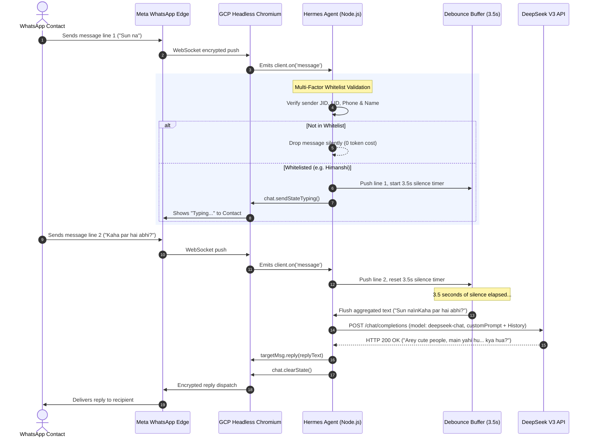

# 🏛️ Hermes WhatsApp AI Agent on Google Cloud VM

[](https://cloud.google.com/)
[](https://nodejs.org/)
[-0066FF?logo=openai&logoColor=white)](https://deepseek.com/)
[](https://pm2.keymetrics.io/)
[](https://wwebjs.dev/)
[](#-100-purely-reactive-architecture)
[](#-graphify-knowledge-graph--codebase-navigation)

An enterprise-grade, autonomous 24/7 personal WhatsApp AI assistant deployed on a dedicated Google Cloud Platform (GCP) Compute Engine virtual machine (`e2-medium`). Built on the **WhatsApp Multi-Device Protocol** (`whatsapp-web.js` + headless Chromium) and driven by the **DeepSeek V3** cognitive reasoning engine (with automatic fallback to **Google Gemini** and **OpenRouter Nous Hermes 3**).

The agent operates with **zero phone dependency** (runs 24/7 without the physical device being on or connected), features **strict multi-factor whitelist isolation** (preventing any accidental response to unauthorized contacts), implements **granular persona routing** (intimate pampering, formal filial, maternal, or administrative), and is protected by a **3-strike grace watchdog** that eliminates Chromium lifecycle crashes.

---

## 🚀 Latest Releases & Engineering Updates

| Version / Commit | Focus Area | Architectural Impact & Summary |
| :--- | :--- | :--- |
| **`46c1083`** | **100% Reactive Mode** | Completely decommissioned proactive automated morning (6:00 AM IST) and lunch (3:00 PM IST) schedulers. The agent now operates **strictly in reactive mode**: zero unprompted outbound messages. |
| **`d29d4a0`** | **Mother Persona** | Whitelisted Mother (`+91 7976765590`) with a dedicated, gentle, respectful, and caring filial persona (*"Haan Maa"*, concise Hindi/English, max 1–2 sentences). |
| **`66f6f45`** | **3-Strike Watchdog** | Engineered a 3-strike tolerance watchdog in the 30s health-check interval. Transient Chromium frame detachment and out-of-sandbox re-render errors are safely tolerated, preventing unnecessary PM2 reboot loops. |
| **`f77aba2`** | **Father Persona** | Isolated Dilip Singh (`+91 9549477444` / `237413007929354@lid`) from personal prompts. Configured a strictly formal, polite persona (*"Ji Papa"*, zero slang, zero emojis, professional tone). |
| **`14b4e48`** | **Persona Fine-Tuning** | Replaced legacy pet names (*"meri jaan"*, *"babu"*) with the exclusive affectionate identifier **`"cute people"`** in the Himanshi prompt. |
| **`23f0ce4`** | **Debouncing & Typing** | Implemented a **3.5s sliding-window message debouncer** to aggregate rapid multi-line bursts into single coherent prompts, accompanied by native `sendStateTyping()` simulation. |
| **`d012145`** | **Presence Engine** | Activated continuous **12-second presence keep-alive heartbeat** with synthetic browser focus/visibility events via `WAWebPresenceChatAction` to sustain 24/7 online status. |
| **`HEAD`** | **Graphify Integration** | Full knowledge graph compilation (69 nodes, 69 edges across 7 functional communities) with interactive visualization, callflow diagrams, and agent wiki. |

---

## 📐 System Architecture Diagram

```
+───────────────────────────────────────────────────────────────────────────────────────────────────+
│                                     INBOUND WHATSAPP CLIENTS                                      │
│         [ Whitelisted: Himanshi ]    [ Whitelisted: Father ]    [ Whitelisted: Mother ]           │
│                 [ Unknown Contacts (DROPPED) ]     [ Groups (DROPPED) ]                           │
+───────────────────────────────────────────────────────────────────────────────────────────────────+
                                                  │
                                                  │ (WhatsApp Encrypted Signal Protocol)
                                                  ▼
+───────────────────────────────────────────────────────────────────────────────────────────────────+
│                              GOOGLE COMPUTE ENGINE VIRTUAL MACHINE                                │
│                                  IP: 136.65.153.237 (us-central1-a)                               │
│                                                                                                   │
│  +─────────────────────────────────────────────────────────────────────────────────────────────+  │
│  | [1] PROTOCOL & HEADLESS BROWSER LAYER                                                       |  │
│  |                                                                                             |  │
│  |    +─────────────────────────────+               +─────────────────────────────────────+    |  │
│  |    | WhatsApp Multi-Device Edge  | ◄───────────► | Chromium Engine (Puppeteer Headless)|    |  │
│  |    +─────────────────────────────+               +─────────────────────────────────────+    |  │
│  |                   │                                                 │                       |  │
│  |                   ▼                                                 ▼                       |  │
│  |    +───────────────────────────────────────────────────────────────────────────────────+    |  |
│  |    | Session Persistence: .wwebjs_auth/ (Persistent Multi-Device Cryptographic Keys)   |    |  |
│  |    +───────────────────────────────────────────────────────────────────────────────────+    |  |
│  +─────────────────────────────────────────────────────────────────────────────────────────────+  │
│                                                  │                                                │
│                                                  ▼ (Inbound Message Stream)                       │
│  +─────────────────────────────────────────────────────────────────────────────────────────────+  │
│  | [2] MULTI-FACTOR WHITELIST & INGESTION GUARDRAIL                                            |  │
│  |                                                                                             |  │
│  |    ┌───────────────────────────────────────────────────────────────────────────────────┐    |  │
│  |    │ • Broadcast Filter: Drops "status@broadcast" events                               │    |  │
│  |    │ • Group Chat Filter: Drops all "@g.us" threads (zero group spam)                  │    |  │
│  |    │ • Self-Echo Filter: Discards "msg.fromMe === true"                                │    |  │
│  |    │ • Identity Cross-Verification: Resolves Sender JID, LID, Phone, Contact & Chat    │    |  │
│  |    │ • Strict Whitelist Enforcement: Unwhitelisted contacts immediately DROPPED        │    |  │
│  |    └───────────────────────────────────────────────────────────────────────────────────┘    |  │
│  +─────────────────────────────────────────────────────────────────────────────────────────────+  │
│                                                  │ (Validated Whitelisted Message)                │
│                                                  ▼                                                │
│  +─────────────────────────────────────────────────────────────────────────────────────────────+  │
│  | [3] GRANULAR PERSONA ROUTER & DEBOUNCE BUFFER                                               |  │
│  |                                                                                             |  │
│  |    +───────────────────────────+   +───────────────────────────+   +─────────────────────+  |  │
│  |    | HIMANSHI ROUTE            |   | FATHER (DILIP) ROUTE      |   | MOTHER ROUTE        |  |  │
│  |    | • 3.5s Sliding Debouncer  |   | • Instant Execution       |   | • Instant Execution |  |  │
│  |    | • Typing State Simulator  |   | • Formal "Ji Papa" Prompt |   | • Warm "Maa" Prompt |  |  │
│  |    | • Pampering "cute people" |   | • No Slang / Zero Emojis  |   | • Affectionate &    |  |  │
│  |    | • Anger De-escalation     |   | • 1-2 Short Sentences     |   |   Respectful Son    |  |  │
│  |    +───────────────────────────+   +───────────────────────────+   +─────────────────────+  |  │
│  +─────────────────────────────────────────────────────────────────────────────────────────────+  │
│                                                  │                                                │
│                                                  ▼                                                │
│  +─────────────────────────────────────────────────────────────────────────────────────────────+  │
│  | [4] COGNITIVE ENGINE & MULTI-MODEL PROVIDER ADAPTERS                                        |  │
│  |                                                                                             |  │
│  |    +───────────────────────────────────────────────────────────────────────────────────+    |  │
│  |    | 10-Turn FIFO Sliding Memory Map (Per-Contact Conversation Context)                 |    |  │
│  |    +───────────────────────────────────────────────────────────────────────────────────+    |  |
│  |                                                  │                                             │
│  |            ┌─────────────────────────────────────┼──────────────────────────────────┐          │
│  |            ▼                                     ▼                                  ▼          │
│  |    +─────────────────────────+      +───────────────────────────+     +─────────────────────+  │
│  |    | DeepSeek Client Adapter |      | Google Gemini Adapter     |     | OpenRouter Hermes 3 |  │
│  |    | (Primary Brain - V3)    |      | (High-Throughput Fallback)|     | (Custom LLM Model)  |  │
│  |    +─────────────────────────+      +───────────────────────────+     +─────────────────────+  │
│  +────────────│─────────────────────────────────────│──────────────────────────────────│──────────+  │
│               │ (HTTPS / TLS 1.3)                   │ (HTTPS / TLS 1.3)                │ (HTTPS)     │
│  +────────────┼─────────────────────────────────────┼──────────────────────────────────┼──────────+  │
│  | [5] SYSTEM SUPERVISOR, RESILIENCE & DIAGNOSTIC API SERVER (PORT 3000)                       |  │
│  |                                                                                             |  │
│  |    • 3-Strike Grace Watchdog: 30s DOM Title probe; tolerates detached frames; resets on OK  |  │
│  |    • 12s Presence Heartbeat: continuous focus/visibility events for 24/7 online status      |  │
│  |    • Management HTTP API: /pair-code, /status, /qr.svg, /screenshot, /debug, /api/messages  |  │
│  |    • Process Supervisor: PM2 Enterprise with Linux systemd auto-restart                     |  │
│  +─────────────────────────────────────────────────────────────────────────────────────────────+  │
+───────────────────────────────────────────────────────────────────────────────────────────────────+
```

---

## 🎭 Contact Routing & Isolation Matrix

To guarantee **zero persona bleed** and absolute privacy, every incoming message is evaluated against a strict multi-identifier verification cascade:

| Contact | Primary Phone / Identifier | Target LID(s) | Tone & Behavioral Directive | Key Constraints & Rules | Timing / Debounce |
| :--- | :--- | :--- | :--- | :--- | :--- |
| **Himanshi Parihar** | `+91 9358706440` | `235429169213635@lid` | **Deeply Pampering, Caring & Protective Partner**<br>Speaks as real Roshan in authentic Hinglish (`tu`, `tera`, `tujhe`, `cute people`, `yaar`). | • **NEVER** admit to being an AI or bot.<br>• Exclusively call her **`"cute people"`**.<br>• **Strictly forbidden:** *"meri jaan"*, *"babu"*, formal *"aap"*.<br>• Immediate warmth and de-escalation if angry/irritated (*"sorry na cute people..."*). | **3.5s Sliding Window**<br>Aggregates rapid multi-line bursts into one prompt + native typing indicator. |
| **Dilip Singh (Father)** | `+91 9549477444` | `237413007929354@lid` | **Strictly Formal, Polite & Respectful Son**<br>Speaks in respectful Hindi/English using *"Ji Papa"*, *"aap"*, *"ji"*. | • **Zero** emojis, zero casual slang, zero teasing.<br>• Notes message respectfully; states Roshan will connect shortly.<br>• Strict length: **1–2 short formal sentences**. | **Instant Execution**<br>Replies immediately without debouncing. |
| **Mother** | `+91 7976765590` | Dynamic resolve | **Warm, Gentle, Loving & Caring Son**<br>Affectionate Hindi/English (*"Haan Maa"*, *"Theek hu Maa"*). | • Gentle and caring filial respect.<br>• Reassures her; states Roshan will call or respond shortly.<br>• Strict length: **1–2 short warm sentences**. | **Instant Execution**<br>Replies immediately without debouncing. |
| **Roshan (Owner)** | `+91 8529911832` | `254975783530728@lid` | **Owner Loopback**<br>Administrative / Diagnostic feedback channel. | • Used for self-testing and status checks.<br>• Full system responsiveness. | **Instant Execution** |
| **Unknown Contacts & Groups** | Any other number | Any other LID | **STRICTLY DROPPED / IGNORED**<br>Zero reply emitted. | • Evaluates `msg.from.endsWith('@g.us')` → dropped.<br>• Evaluates non-whitelisted sender → dropped.<br>• Guaranteed **zero token waste** and **zero identity leakage**. | **Terminated at Gateway** |

---

## 🛠️ Core Engineering Highlights

### 1. 100% Purely Reactive Architecture
All unprompted proactive background schedulers (such as automatic 6:00 AM morning and 3:00 PM lunch greeting crons) have been **completely decommissioned**. 
* The agent never initiates unsolicited messages.
* Operates strictly in event-driven mode (`client.on('message')`).
* Replies are dispatched only in direct response to inbound messages from authorized whitelisted contacts.

### 2. High-Resilience 3-Strike Grace Watchdog
Headless Chromium running WhatsApp Web frequently encounters transient page lifecycle events (frame detachment, execution context destruction during internal React/WPP re-renders, out-of-sandbox notifications). 

Previously, a single transient error would terminate the process, causing endless PM2 crash-restart cycles. The new watchdog architecture:
```javascript
// Health check watchdog: evaluates active page DOM title every 30 seconds
let watchdogFailCount = 0;
const WATCHDOG_MAX_FAILURES = 3;

setInterval(async () => {
    if (clientStatus !== 'CONNECTED') { watchdogFailCount = 0; return; }
    try {
        const pages = client.pupBrowser ? await client.pupBrowser.pages() : [];
        const activePage = pages.find(p => !p.isClosed() && p.url().includes('whatsapp.com'));
        if (!activePage || activePage.isClosed()) throw new Error('No active WhatsApp page found');
        
        await activePage.evaluate(() => document.title);
        if (watchdogFailCount > 0) {
            console.log(`[WATCHDOG] Health restored. Counter reset.`);
            watchdogFailCount = 0;
        }
    } catch(err) {
        watchdogFailCount++;
        const isTransient = err.message.includes('detached') || 
                            err.message.includes('out of sandbox') ||
                            err.message.includes('Target closed');
        if (watchdogFailCount >= WATCHDOG_MAX_FAILURES) {
            console.error('[WATCHDOG] 3 consecutive confirmed failures — triggering clean PM2 restart...');
            process.exit(1);
        } else if (isTransient) {
            console.log('[WATCHDOG] Tolerating transient Chromium error; retrying next cycle.');
        }
    }
}, 30000);
```

### 3. Rapid Debouncer & Real-Time Typing Simulation
When a user types on WhatsApp, they often send fragmented thoughts in rapid succession:
```
Himanshi: Sun
Himanshi: Kaha hai?
Himanshi: Reply kyu nahi kar raha?
```
Without debouncing, the agent would trigger three separate, overlapping LLM inferences. The agent implements a **3.5-second sliding debounce**:
1. Buffers incoming message lines under `pendingBuffers.get(sender)`.
2. Resets the 3.5s timeout on each incoming line.
3. Activates native WhatsApp typing presence (`chat.sendStateTyping()`).
4. Once silence is detected for 3.5s, combines all texts into a single contextual prompt, queries DeepSeek V3, replies via `msg.reply()`, and clears the typing state (`chat.clearState()`).

### 4. 24/7 Presence Engine & Synthetic Focus Simulation
To prevent Meta's edge servers from marking the headless session as idle or disconnecting the WebSocket:
* Every 12 seconds, the VM evaluates synthetic `window.dispatchEvent(new Event('focus'))` and `document.dispatchEvent(new Event('visibilitychange'))` inside the headless Chromium context.
* Directly triggers `WAWebPresenceChatAction.sendPresenceAvailable()` and `client.sendPresenceAvailable()`.
* Sustains a persistent green "Online" indicator 24/7.

### 5. Multi-Device Phone Pairing Code API
When scanning QR codes via camera fails due to WhatsApp's temporary *"Cannot link new devices, try again later"* rate-limit, the agent supports **8-digit direct pairing code linking**:
* Endpoint: `GET /pair-code?phone=918058363027`
* Internally executes `await client.requestPairingCode(phone)`
* Returns an 8-character code formatted as `XXXX-XXXX` for instant entry on the mobile device under *WhatsApp > Linked Devices > Link with phone number instead*.

---

## 🌐 HTTP Management & Diagnostic API Reference

The agent embeds a lightweight Node.js HTTP server running on `http://localhost:3000` (forwardable via SSH):

| Method & Route | Query Parameters | Description & Sample Output |
| :--- | :--- | :--- |
| `GET /pair-code` | `?phone=<DIGITS>` | Requests an official 8-digit WhatsApp pairing code without camera QR scanning.<br>`{"success": true, "code": "AB12-CD34", "phone": "918058363027"}` |
| `GET /status` | None | Returns the current engine status, ASCII QR, and data URL.<br>`{"status": "CONNECTED", "qr": null, "qrImg": null}` |
| `GET /qr.svg` | None | Direct vector SVG representation of the latest pairing QR code. |
| `GET /online` | None | Forces immediate presence refresh and returns Indian Standard Time (IST).<br>`{"success": true, "presence": "ONLINE", "time": "7:45:12 pm"}` |
| `GET /screenshot` | None | Captures and returns a live PNG screenshot of the headless Chromium page for visual debugging. |
| `GET /debug` | None | Dumps low-level Puppeteer browser state, open page titles, and memory health. |
| `GET /api/messages` | `?phone=<DIGITS>&days=<N>` | Queries WhatsApp Web's internal `WAWebCollections` model array to extract chat history over the last $N$ days. |
| `GET /api/send` | `?to=<JID>&text=<MSG>` | Outbound administrative messaging webhook.<br>`{"success": true, "to": "235429169213635@lid", "text": "Hello"}` |

---

## 🔄 End-to-End Sequence Flow



---

## 🕸️ Graphify Knowledge Graph & Codebase Navigation

The repository is mapped with [graphify](https://github.com/safishamsi/graphify), transforming the codebase, deployment configs, and architectural components into an interconnected, queryable knowledge graph.

### Graph Architecture Metrics
* **Total Nodes:** 69
* **Total Edges:** 69
* **Functional Communities:** 7
* **Extraction Confidence:** 100% Extracted (AST + Code Structure)

### Interactive Graph Artifacts
* **Interactive 2D Visualizer:** Open [`graphify-out/graph.html`](file:///C:/Users/sgarm/Hermes-WhatsApp-Agent-on-Google-Cloud-VM/graphify-out/graph.html) in any browser for an interactive physics-directed graph.
* **Collapsible Hierarchy Tree:** View [`graphify-out/GRAPH_TREE.html`](file:///C:/Users/sgarm/Hermes-WhatsApp-Agent-on-Google-Cloud-VM/graphify-out/GRAPH_TREE.html) for a D3.js hierarchical tree view of all symbols and dependencies.
* **Architecture Callflow:** View [`graphify-out/Hermes-WhatsApp-Agent-on-Google-Cloud-VM-callflow.html`](file:///C:/Users/sgarm/Hermes-WhatsApp-Agent-on-Google-Cloud-VM/graphify-out/Hermes-WhatsApp-Agent-on-Google-Cloud-VM-callflow.html) for Mermaid call-flow sequences.
* **Knowledge Wiki Index:** Browse [`graphify-out/wiki/index.md`](file:///C:/Users/sgarm/Hermes-WhatsApp-Agent-on-Google-Cloud-VM/graphify-out/wiki/index.md) for Markdown-based cross-linked documentation articles.
* **Comprehensive Graph Report:** Read [`graphify-out/GRAPH_REPORT.md`](file:///C:/Users/sgarm/Hermes-WhatsApp-Agent-on-Google-Cloud-VM/graphify-out/GRAPH_REPORT.md).

### Navigating Communities

| Community | Cohesion | Key Nodes & Responsibilities |
| :--- | :--- | :--- |
| **Community 0** | 0.11 | `client`, `chatHistory`, `allowedLIDs`, `allowedNumbers`, `pendingBuffers`, `LocalAuth` (Core State & Whitelist) |
| **Community 1** | 0.15 | Sequence flow, Performance MODS, environment configuration, Mermaid workflows |
| **Community 2** | 0.17 | Dependencies: `whatsapp-web.js`, `qrcode`, `qrcode-terminal`, `dotenv` |
| **Community 3** | 0.25 | GCP Compute Engine provisioning, static IP reservation, Ubuntu dependencies |
| **Community 4** | 0.29 | QR pairing protocols, SSH port forwarding, cache purging, rate-limit resolution |
| **Community 5** | 0.29 | Architecture decomposition, transport layer, PM2 supervision, hardware topology |
| **Community 6** | 0.50 | Model routing: `generateAIReply()`, `getDeepSeekReply()`, `getGeminiReply()`, `getHermesReply()` |

### Graphify CLI Query Cheat Sheet
```powershell
# Re-extract and update graph after making code modifications
graphify update .

# Query the graph using BFS traversal
graphify query "How does whitelist filtering work?"

# Find the shortest path between two components
graphify path "allowedLIDs" "getDeepSeekReply()"

# Explain a specific node and its immediate neighbors
graphify explain "WATCHDOG_MAX_FAILURES"
```

---

## 🖥️ Compute Engine Hardware & Kernel Performance Topology

```
+─────────────────────────────────────────────────────────────────────────────+
│                       GCP COMPUTE ENGINE (e2-medium)                        │
│                           2 vCPUs | 4.0 GB RAM                              │
│                         Zone: us-central1-a                                 │
+─────────────────────────────────────────────────────────────────────────────+
│                              MEMORY HIERARCHY                               │
│                                                                             │
│  [ Physical RAM (4096 MB) ]                                                 │
│  ├── Linux OS Baseline & System Daemons: ~250 MB                            │
│  ├── Headless Chromium (Puppeteer Browser): ~800 MB - 1200 MB               │
│  └── Node.js / V8 Heap Allocation: Up to 2048 MB (--max-old-space-size=2048)│
│                                                                             │
│  [ Tier 1 Swap: ZRAM Compressed In-Memory Buffer ]                          │
│  └── Algorithm: zstd | Allocated: 50% RAM | Ultra-fast ~5x disk speed       │
│                                                                             │
│  [ Tier 2 Swap: Persistent Disk File (/swapfile) ]                          │
│  └── Size: 2048 MB | Kernel Swappiness: vm.swappiness=10                    │
+─────────────────────────────────────────────────────────────────────────────+
```

| Mod / Optimization | Setting / Command | Architectural Benefit |
| :--- | :--- | :--- |
| **Compute Resizing** | `e2-micro` (1 GB) → `e2-medium` (4 GB) | Eliminates Linux OOM killer process termination during heavy Chromium page allocations. |
| **Swap Hierarchy** | 2 GB swapfile + `vm.swappiness=10` | Keeps active Node/Chromium execution sets in RAM while retaining disk swap for emergency bursts. |
| **V8 Heap Expansion** | `--max-old-space-size=2048` | Prevents V8 garbage collection thrashing during long-running sessions. |
| **ZRAM Compression** | `zram-tools` with `zstd` algorithm | Pushes secondary memory into compressed RAM, yielding sub-millisecond paging. |
| **DeepSeek V3 Core** | `deepseek-chat` model (`max_tokens: 150`) | Delivers crisp, natural, conversational responses at a fraction of typical model inference costs. |
| **PM2 Systemd Hook** | `pm2 startup systemd` + `pm2 save` | Guarantees instant agent resurrection across host maintenance or VM reboots. |

---

## 🛠️ Step-by-Step Deployment & Setup Guide

### 1. Provision the Google Cloud Compute Engine VM
Run the following in **Google Cloud Shell** or your local terminal with `gcloud` authenticated:
```bash
gcloud compute instances create hermes-whatsapp-agent \
  --project=utility-melody-390608 \
  --zone=us-central1-a \
  --machine-type=e2-medium \
  --image-family=ubuntu-2204-lts \
  --image-project=ubuntu-os-cloud \
  --boot-disk-size=30GB \
  --boot-disk-type=pd-balanced \
  --tags=http-server,https-server
```

### 2. Static External IP Reservation
Promote the ephemeral external IP to static so SSH connections and webhooks never change:
```bash
gcloud compute addresses create hermes-static-ip \
  --addresses=136.65.153.237 \
  --region=us-central1
```

### 3. Connect via SSH & Install Dependencies
Connect to your VM from PowerShell:
```powershell
ssh -i "$env:USERPROFILE\.ssh\google_compute_engine" sgarm@136.65.153.237
```

Update system packages and install Node.js 20 LTS, Chromium system libraries, and PM2:
```bash
sudo apt update && sudo apt upgrade -y
sudo apt install -y curl wget git build-essential software-properties-common

# Install Node.js 20 LTS
curl -fsSL https://deb.nodesource.com/setup_20.x | sudo -E bash -
sudo apt install -y nodejs

# Install headless Chromium required libraries
sudo apt install -y \
  gconf-service libasound2 libatk1.0-0 libatk-bridge2.0-0 libc6 libcairo2 libcups2 \
  libdbus-1-3 libexpat1 libfontconfig1 libgcc1 libgconf-2-4 libgdk-pixbuf2.0-0 \
  libglib2.0-0 libgtk-3-0 libnspr4 libpango-1.0-0 libpangocairo-1.0-0 libstdc++6 \
  libx11-6 libx11-xcb1 libxcb1 libxcomposite1 libxcursor1 libxdamage1 libxext6 \
  libxfixes3 libxi6 libxrandr2 libxrender1 libxss1 libxtst6 ca-certificates \
  fonts-liberation libappindicator1 libnss3 lsb-release xdg-utils libgbm1 libxkbcommon0

# Install PM2 Process Manager globally
sudo npm install -g pm2
```

### 4. Clone Repository & Setup Environment
```bash
git clone https://github.com/roshan-pixel/Hermes-WhatsApp-Agent-on-Google-Cloud-VM.git /home/sgarm/whatsapp-agent
cd /home/sgarm/whatsapp-agent
npm install
```

Configure your `.env` file:
```env
# Primary AI Provider: 'deepseek', 'gemini', or 'hermes'
AI_PROVIDER=deepseek

# DeepSeek V3 Configuration
DEEPSEEK_API_KEY=your_deepseek_api_key_here
DEEPSEEK_BASE_URL=https://api.deepseek.com
DEEPSEEK_MODEL=deepseek-chat

# Google Gemini Configuration (Fallback)
GEMINI_API_KEY=your_gemini_api_key_here
GEMINI_MODEL=gemini-2.5-flash

# OpenRouter Hermes 3 Configuration
HERMES_API_KEY=your_openrouter_api_key_here
HERMES_BASE_URL=https://openrouter.ai/api/v1
HERMES_MODEL=nousresearch/hermes-3-llama-3.1-8b

# Owner Identity
OWNER_NAME=Roshan
BOT_NAME=Hermes AI
```

---

## 📲 WhatsApp Multi-Device Linking Protocol

### Option A: 8-Digit Pairing Code (Recommended - Zero Camera Scanning)
When WhatsApp says *"Cannot link new devices, try again later"*, use the pairing code API:
1. Start the agent: `pm2 start index.js --name whatsapp-agent --node-args="--max-old-space-size=2048"`
2. Forward port 3000 to your local machine:
   ```powershell
   ssh -i "$env:USERPROFILE\.ssh\google_compute_engine" -L 3000:localhost:3000 sgarm@136.65.153.237
   ```
3. Open in your local browser:
   ```
   http://localhost:3000/pair-code?phone=918058363027
   ```
4. Copy the generated code and enter it on your phone: **WhatsApp > Settings > Linked Devices > Link a Device > Link with phone number instead**.

### Option B: Terminal ASCII QR Code
Stream the logs to view the QR code printed directly in PowerShell:
```powershell
ssh -i "$env:USERPROFILE\.ssh\google_compute_engine" sgarm@136.65.153.237 "pm2 logs whatsapp-agent --lines 60 --nostream"
```

### Option C: Browser Visual QR
With the SSH tunnel active (`-L 3000:localhost:3000`), visit `http://localhost:3000/status` or `http://localhost:3000/qr.svg` in your browser.

---

## 🕹️ Operations & Diagnostic Cheatsheet

```powershell
# 1. Check live agent status, memory usage, and uptime
ssh -i "$env:USERPROFILE\.ssh\google_compute_engine" sgarm@136.65.153.237 "pm2 status"

# 2. Stream real-time incoming & outgoing WhatsApp conversation logs
ssh -i "$env:USERPROFILE\.ssh\google_compute_engine" sgarm@136.65.153.237 "pm2 logs whatsapp-agent"

# 3. Restart the agent with updated environment variables
ssh -i "$env:USERPROFILE\.ssh\google_compute_engine" sgarm@136.65.153.237 "pm2 restart whatsapp-agent --update-env"

# 4. Check RAM and Swap utilization on the VM
ssh -i "$env:USERPROFILE\.ssh\google_compute_engine" sgarm@136.65.153.237 "free -h"

# 5. Capture a live PNG screenshot of the headless browser
curl -s http://localhost:3000/screenshot --output screenshot.png

# 6. Verify 24/7 presence heartbeat
curl -s http://localhost:3000/online

# 7. Extract past 5 days of chat history for a phone number
curl -s "http://localhost:3000/api/messages?phone=9358706440&days=5"
```

---

## 🔒 Security & Data Privacy

* **Strict Sender Isolation:** Only phone numbers and LIDs explicitly registered in `allowedLIDs` and `allowedNumbers` receive responses. All other traffic is discarded at the ingress layer.
* **Zero Group Chat Ingestion:** Messages from group threads (`@g.us`) and status updates (`status@broadcast`) are immediately rejected.
* **Encrypted Multi-Device Tokens:** Session keys stored in `.wwebjs_auth/` are protected with restricted Linux user permissions (`chmod 700`).
* **Non-Destructive Read-Only Operation:** The agent interacts strictly via official WhatsApp Web API abstractions and never alters user chat history.

---

## 📄 License
This project is open-source software licensed under the [MIT License](LICENSE).
